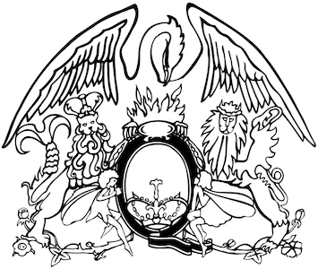

+++
title = 'El escudo de Queen'
date = 2023-03-15T11:00:00-07:00
draft = false
tags = ['Freddie Mercury','Ealing Art College of Londres','Brian May', 'Roger Taylor', 'John Deacon', 'Escudo', 'logotipo']
+++

_____

Todo fan de la banda sabe que uno de sus símbolos es ese logotipo inspirado en un escudo de armas que los acompaña a modo de marca muy característico e inconfundible.   
Este emblema fué diseñado en 1971 por el mismo **Freddie Mercury** que era estudiante de artes y diseño en el **Ealing Art College of Londres**, para darle más identidad al grupo.

El escudo que ostenta el logo es una ilustración muy detallada con muchos símbolos ocultos. Se compone de los símbolos del zodíaco de cada uno de los miembros de la banda, el **cangrejo** (Cáncer) que es el signo de **Brian May**, los dos **leones** (Leo) los signos de **Roger Taylor** y **John Deacon** y dos **ninfas** (Virgo) para representar el signo de **Freddie**, complementado con el **ave Fénix** y la letra «Q» con la corona en el interior.El ave Fénix es un símbolo de vida, poder y pasión que simboliza el renacer de la banda a partir de sus conjuntos musicales anteriores, considerados como cenizas de oportunidades fallidas y fracasos de experiencias musicales anteriores. Como consecuencia, el ave fénix se convirtió en algo simbólico de esperanza y renovación. Los leones abrazan la letra «Q», que tiene un cangrejo sentado en su parte superior, las hadas se colocan por encima de los leones. Y el Fénix está situado en la parte superior del emblema.

# Sus dos versiones

En **1973** aparece la primera versión del icónico logotipo de **Queen**, esta imagen presentaba un emblema de animal ornamentado, donde las criaturas se colocaban alrededor de la cresta ovalada con la corona. En esta versión, aparece una llama en la parte superior del óvalo y el pájaro grande semejante a un cisne está dibujado en líneas limpias y ordenadas. Este logo fue utilizado poco tiempo hasta 1975, cuando Mercury agregó toques finales y un estilo más exclusivo.

La nueva y última versión hecha en **1975** tenía más detalles y nuevos animales. además de las letras “Queen” que ahora aparecían debajo de la insignia, con una tipografía imponente,  y en mayúsculas dándole un estilo elegante. El sentimiento de grandeza creció después de este rediseño. Los detalles detrás de cada línea y elemento son increíblemente reveladores.

Este escudo de la banda se convirtió en un símbolo histórico dentro del mundo del rock y lo hace más especial aún por ser creado por una leyenda del rock y la música en general como era Freddie Mercury.
