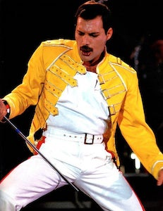

+++
title = 'La chaqueta amarilla de Freddie Mercury'
date = 2023-03-15T11:00:00-07:00
draft = false
tags = ['Freddie Mercury','Magic Tour','Diana Moseley', 'Adidas', 'The Miracle', 'Ross McCall', 'Wembley']
+++

____

La famosa chaqueta amarilla que llevó **Freddie Mercury** durante el **Magic Tour** de 1986 representa una de las prendas ligadas a la historia de la música más recordadas, así como una de las principales imágenes del cantante en la memoria colectiva.

La chaqueta de corte militar inspirada en el vestuario de la ópera española, fue realizada por **Diana Moseley**, la diseñadora de vestuario de confianza de Queen en aquella época.​ Moseley había conocido a Freddie en abril de 1985, cuando le entregó las prendas que tenía que usar en el videoclip de **I Was Born to Love You**. La diseñadora ya había trabajado indirectamente con la banda para el vestuario de **Radio Ga Ga**, colaboraría también para **The Great Pretender** y **I'm Going Slightly Mad**, pero su trabajo más célebre es la famosa prenda que nos ocupa.

Ésta fue complementada con camiseta de tirantes casi siempre blanca, pantalones también blancos con ribetes laterales rojos o amarillos, y un par de botas de boxeo blancas con rayas negras de la marca **Adidas**.​ Esta sería la ropa de trabajo del vocalista durante todo el tour por Europa y en el video **The Miracle** de 1989.​ En este videoclip, también la lleva el actor escocés **Ross McCall**, entonces de trece años, que interpreta una versión más joven del cantante.

Hay que aclarar que en la gira se usaron distintas versiones de la chaqueta amarilla en diferentes colores (una en blanco, y otra blanca con las correas en color rojo), pero la que permanece en la memoria de la gente, es la de color amarillo por ser la que usó en el mítico estadio de **Wembley** donde se dio el pistoletazo de salida del Magic Tour.
Posteriormente la chaqueta se convirtió en uno de los elementos más famosos de la figura de Freddie Mercury, a menudo reproducida en las representaciones póstumas del cantante.

La prenda fue vendida en **Bonhams** el 16 de noviembre de 2004 por un valor de 26.290 libras esterlinas. En la actualidad se conserva en una colección privada.

Sin lugar a dudas, pocas prendas tienen el honor de convertirse en un icono en la historia de la música, pero esta chaqueta permanece y permanecerá en el recuerdo colectivo de la gente como algo ligado a Freddie Mercury por siempre.
