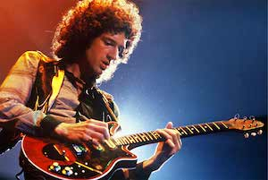

+++
title = 'La Red Special'
date = 2023-03-15T11:00:00-07:00
draft = false
tags = ['Brian May','Fender','Burns Tri-Sonic', 'Guild', 'Red Special', 'Andrew Guyton']
+++

____

Si hay algo en lo que todos estamos de acuerdo, es que un aspecto característico en la música de Queen es ese sonido de guitarra que al oírlo sabes que **Brian May** se ha puesto manos a la obra, dotando a la música de Queen de una identidad propia.

Todo empezó en 1963 cando un joven Brian andaba desesperado por conseguir una guitarra ]]**Fender**, pero su economía familiar no era de lo mejor en aquella epoca, así que con la ayuda de su padre, que era ingeniero, decidió construir una **guitarra casera**.

A partir de una madera de caoba de una chimenea hizo el mastil. Para el diapasón y para el cuerpo cogió un robusto trozo de roble. El diapasón lo pintó de negro y el cuerpo lo pintó de color cereza. Para los inlays del diapasón cogió unos botones de nácar que su madre tenía en el costurero. El brazo del trémolo fue hecho con un trozo de acero de una bicicleta, al que él mismo le dio forma, y en la punta colocó un trozo de plástico de las agujas de hacer ganchillo. Para los muelles del trémolo usó dos resortes de válvulas de motocicleta.

Su intención era hacer las pastillas él mismo, pero al final decidió comprar tres pastillas simples **Burns Tri-Sonic**, que luego modificó a su gusto.

En cuanto a interruptores comenzó con siete, aunque posteriormente fueron seis: un On/Off y un inversor de fase para cada una de las tres pastillas. A todo esto hay que añadirle sus dos potenciómetros: uno de volumen general y otro de tono general.

Tras un año y medio, y con un coste de 18 libras esterlinas, acabó la guitarra, la cual no se parecía a ninguna otra.

Sin darse cuenta, fabricó una guitarra con un sonido propio y totalmente inconfundible que se convertiría en leyenda, y que a día de hoy sigue sin desafinar: la **Red Special**. Una guitarra que May usó durante toda su carrera y que sigue usando mientras se escriben estas líneas.

En 2004, el luthier inglés **Andrew Guyton** comenzó la fabricación de 50 copias de la Red Special. Cuarenta en rojo (por el 40º aniversario de la guitarra) y 10 en verde (a Brian le gustaban mucho las réplicas de **Guild** hechas en ese color).

A principios de 2006, la guitarra fue nuevamente objeto de mejoras, con la instalación de un nuevo jack y el reemplazo del traste 0.   
El retraso completo del mástil fue sugerido para facilitar a Brian la ejecución (ya que, después de la gira de 2005, sufrió de dolores en su mano izquierda), pero el guitarrista no quiso saber nada al respecto.

Hoy en día se comercializan dos versiones distintas de esta mítica guitarra que hace las delicias de los que pueden hacerse con ella. Un objeto que pasará a la historia de la música al igual que su creador y a la banda que acompañó durante su larga carrera de éxitos.
